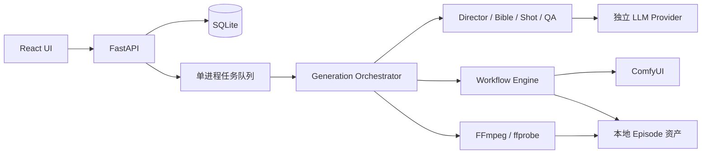

# 模块设计

## C06 快速导入与 AI 建议

导入仅调用 Analyzer 做 JSON 结构、链接完整性和可写字段提取，并保存用户用途/显式绑定；既有 Input/Output 标签作为显式配置保留。删除 C05 `discovery.py` 规则推断。列表/详情从已存参数返回绑定状态，不重新分析拓扑，也不请求 ComfyUI 或模型服务。

`workflows/recognition.py` 只在用户点击 AI 识别时使用已有 LLMProvider。上下文包含节点、连接、截断的字段示例和可写字段列表，不拉完整 object_info；敏感命名字段脱敏，上下文最多 80000 字符。输出 schema 禁止额外字段，服务端检查真实目标、参数类型、重复占用、能力匹配及显式帧数规则；允许部分建议和不确定说明。总等待上限 45 秒，客户端断开取消模型请求。

识别接口不保存，返回建议与原因。前端先展示建议，确认后仅填入空用途/空输出，保留已有手动选择；导入按钮不等待识别，文件/用途变化与关闭界面会丢弃并取消旧请求。参数与输出页面只展示 JSON 实际可写字段，在每行设置用途、值、owner/覆盖规则；不再创建固定参数行。依赖检查和试跑保持单独入口。无数据库迁移，ParameterResolver、deepcopy patch 和生成恢复契约不变。

## 边界与数据流

## 模块分工（实施契约）

| 目录 | 责任 | 不承担的责任 |
| --- | --- | --- |
| `backend/app/core/` | 环境配置、结构化错误、URL/文件安全 | 从 Agent 内容取得任意网络地址 |
| `backend/app/db/` | SQLite SQLAlchemy 仓储、原子状态更新 | 长事务跨网络等待 |
| `backend/app/workflows/` | API JSON 分析、输入 schema、角色 binding、deepcopy patch、依赖校验 | 写死节点 ID 或原地修改模板 |
| `backend/app/comfyui/` | 上传、prompt、WS/history、结果下载和特定任务取消 | 叙事/QA 决策 |
| `backend/app/agents/` | schema 受限的 Director/Bible/Shot/视觉 QA | 执行 shell、修改设置或直接发渲染请求 |
| `backend/app/generation/` | 队列、可恢复作业、资产流水线、连续性与重试 | 多机分布式调度 |
| `backend/app/media/` | ffprobe、帧提取、规范化和合成 | 替代 AI 渲染 |
| `backend/app/api/` | API/SSE/文件边界与资源操作 | 假装外部依赖可用 |
| `frontend/src/` | 创建、设置、工作流库、Episode/Shot 预览 | 持久保存/读取已存密钥或决定服务端状态 |

## 持久化与任务

实体：WorkflowProfile、Episode（含 plan/bible/continuity）、Shot、Asset、RenderJob、QAResult、设置。资产路径以 Episode ID 分区，文件名由服务端生成。工作流 hash 与使用参数写入 RenderJob。每次执行使用工作流快照，后续编辑不会改变已提交的渲染。

QAResult 为独立追加记录，包含 candidate/keyframes/video 阶段、镜头和资产 ID、六维分数及问题。重试不会覆盖失败证据；镜头聚合保留最近结果供 UI 展示。删除单集同时删除作业和质检元数据，资产清理需显式参数。

生成请求只入队即返回；单 worker 顺序消费，ComfyUI 渲染锁同样约束 Workflow 试跑。每一步完成后持久化。重复生成请求不能创建并行 Episode 运行。取消只删除自身 pending prompt；仅在 ComfyUI 当前运行 prompt 匹配时才 interrupt。提交超时不能盲目重发，因为服务端可能已经受理。

重启将中断的 Episode 标为可诊断失败；已知 prompt_id 可以读取历史恢复结果，未知提交保留 UNKNOWN 状态待核对，禁止自动重复收费渲染。重试复用已成功的计划、参考与镜头资产；视频重试不强制重新生成关键帧。修改/重排上游镜头后失效依赖它的连续镜头及旧成片。

## 质量与媒体

`core/limits.py` 集中定义成片 1～600 秒、六个首页预设、新计划最多 240 镜以及尺寸/FPS/batch 边界；duration.py 仅保留兼容导出。成片时长属于产品策略，单镜头时长属于工作流能力；扩展成片范围不要求提高单镜渲染上限。

Director 按百分之一秒分配总时长，再以最多 12 镜为一批请求模型。每批携带原始 Idea、完整目标时长、起始时间、是否最后一批、统一标题/梗概及最近三镜上下文；合并后重排全局索引，仅整集第一镜强制建立场景。批次间和重试前检查取消；完整计划成功后持久化，规划中断后重新规划。Bible 和后续渲染共用整集设定，逐镜顺序执行。

按 workflow 最大时长和最低 1 秒规划，合计误差不超过 0.5 秒；FPS/长度适配显式写进 binding transform。关键帧后先 QA，再视频；VLM 未配置时明确报告跳过视觉 QA，只执行媒体技术检查。Reference Pack 通过工作流支持的 reference 输入传递，不支持时以 Bible prompt 保持文本一致性并给出能力提示。

CONTINUE_FRAME 使用上一镜实际视频在导出时长内的尾帧；CONTINUE_VIDEO 仅在工作流声明并绑定该能力时启用，否则降级为帧连续。QA 失败按角色/场景、动作、过渡分流。OOM 先降分辨率和 batch，再使用短分段（如配置替代 profile 则同时切换）；保留目标时间线。分段继承实际输出尾帧；替代 profile 使用自身节点参数。OOM 和 QA 共用每镜重试预算，用尽明确失败。

FFmpeg 使用参数数组启动、无 shell，限时运行；先探测文件，统一尺寸/FPS/编码和音轨再拼接，按目标镜头时长裁切；缺少音轨补静音以保留已有原生音频。成片成功需 ffprobe 验证，不能只看文件存在。

镜头边界按累计时间对齐帧网格，避免逐镜取整误差累加；必要时补不足一帧的末帧。临时 MOV 使用 H.264 与 PCM 音轨，拼接清单明确每段时长，最终只编码一次 AAC，避免音频填充累积。临时 PCM 音轨约占 192 KB/秒，合成结束自动清理；最终成片仍为 MP4。

## 在线配置

`core/runtime_settings.py` 管理在线覆盖层，`GET/PATCH /settings` 提供脱敏读取和局部更新。`Settings` 共享对象在持久化成功后一次更新，GenerationService、LLMProvider、ComfyUIClient 及上传限制读取新值；有活动作业时拒绝保存。URL 校验发生异步等待后再次检查活动状态，避免校验期间新任务入队的竞争。

密钥只写入数据目录中权限 0600 的 `runtime-settings.json`，不写入公共 settings 记录，也不在读取/保存响应或错误中回显。原子替换失败时不发布内存配置；空输入保留，显式清除覆盖环境回退。启动加载线上覆盖，并兼容原数据库 ComfyUI 地址。数据目录和允许网页来源继续属于启动配置。

## Workflow 与自动参数解析（C03）

WorkflowProfile 以 media_type + capability 确定文生图、图生图、首尾帧视频或首帧视频；type 只作为旧 API 别名。`workflows/ownership.py` 推导角色 owner 并应用可编辑规则，保留 Analyzer、动态 object_info 约束与原始 Role Binding。Director/Shot/Bible 上下文携带 AI 参数的类型、范围和枚举，输出经本地 schema 与节点约束检查。

`generation/parameters.py` 合并工作流默认、自动值和高级覆盖，并验证能力/资源边界；渲染快照记录输入、显式覆盖和来源，签名包含 capability、规则和覆盖值。`generation/resolvers.py` 的 ContinuityManager 提供角色/风格参考与前镜实际视频，AssetResolver 校验素材类型、归属和文件后上传；缺少实际素材时阻止提交。

C04：`agents/parameters.py` 为 Bible/Shot 构造按 workflow ID 隔离的 AI 参数 schema；允许键来自 owner=ai 的动态元数据，并严格执行本地值校验。Resolver 合并 AI 语义参数，Engine 单独保存原始 AI 映射、纳入签名，并在最终 patch 前再次按 object_info 校验。非语义参数也能自动 patch；用户覆盖最后生效，非法 AI 值不能被覆盖隐藏。流水线按视频 capability 选择单帧或双帧生成/QA，OOM 分段同样按实际使用的 profile 分支。

`workflows/router.py` 封装按能力查询、匹配校验和旧媒体默认兼容。GenerationService 创建/读取 Episode 及低显存替代项统一经过该入口；显式 ID 不被默认路由覆盖。当前不包含新的 UI 选择流程或自动打分选型。

参考资产由默认 TEXT_TO_IMAGE profile 起步，关键帧可选 IMAGE_TO_IMAGE，输入角色参考或刚生成的首帧。视频 capability 决定必须首帧或首尾帧。视频参考需要实际前镜或显式上传；不会为缺失素材伪造路径。原有连续性、Visual Bible、QA、实际尾帧及 FFmpeg 处理保留。

高级时长覆盖在规划前换算并校验，确保每镜时长和整集目标一致。OOM 后以显式恢复标志让较小尺寸、batch、分段时长和实际分段尾帧优先，不能被用户原始覆盖重新放大或替换；替代 profile 继续使用自身节点参数。

`db/migrations.py` 在启动 bootstrap 前运行版本 1 的原子迁移，版本写入 schema_migrations。补全旧工作流/作业快照的身份和元数据、Episode 高级模式及覆盖默认字段；已提交图、prompt_id、资产和超过新上限的旧计划保持不变。失败回滚本次记录更新；重复启动不重复迁移。
