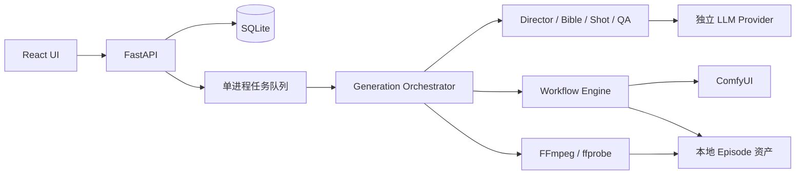

# 模块设计

## 边界与数据流

## 模块分工（实施契约）

| 目录 | 责任 | 不承担的责任 |
| --- | --- | --- |
| `backend/app/core/` | 环境配置、结构化错误、URL/文件安全 | 从 Agent 内容取得任意网络地址 |
| `backend/app/db/` | SQLite SQLAlchemy 仓储、原子状态更新 | 长事务跨网络等待 |
| `backend/app/workflows/` | API JSON 分析、输入 schema、角色 binding、deepcopy patch、依赖校验 | 写死节点 ID 或原地修改模板 |
| `backend/app/comfyui/` | 上传、prompt、WS/history、结果下载和特定任务取消 | 叙事/QA 决策 |
| `backend/app/agents/` | schema 受限的 Director/Bible/Shot/视觉 QA | 执行 shell、修改设置或直接发渲染请求 |
| `backend/app/generation/` | 队列、可恢复作业、资产流水线、连续性与重试 | 多机分布式调度 |
| `backend/app/media/` | ffprobe、帧提取、规范化和合成 | 替代 AI 渲染 |
| `backend/app/api/` | API/SSE/文件边界与资源操作 | 假装外部依赖可用 |
| `frontend/src/` | 创建、设置、工作流库、Episode/Shot 预览 | 持有模型密钥或决定服务端状态 |

## 持久化与任务

实体：WorkflowProfile、Episode（含 plan/bible/continuity）、Shot、Asset、RenderJob、QAResult、设置。资产路径以 Episode ID 分区，文件名由服务端生成。工作流 hash 与使用参数写入 RenderJob。每次执行使用工作流快照，后续编辑不会改变已提交的渲染。

生成请求只入队即返回；单 worker 顺序消费，ComfyUI 渲染锁同样约束 Workflow 试跑。每一步完成后持久化。重复生成请求不能创建并行 Episode 运行。取消只删除自身 pending prompt；仅在 ComfyUI 当前运行 prompt 匹配时才 interrupt。提交超时不能盲目重发，因为服务端可能已经受理。

重启将中断的 Episode 标为可诊断失败；已知 prompt_id 可以读取历史恢复结果，未知提交保留 UNKNOWN 状态待核对，禁止自动重复收费渲染。重试复用已成功的计划、参考与镜头资产；视频重试不强制重新生成关键帧。修改/重排上游镜头后失效依赖它的连续镜头及旧成片。

## 质量与媒体

按 workflow 最大时长和最低 1 秒规划，合计误差不超过 0.5 秒；FPS/长度适配显式写进 binding transform。关键帧后先 QA，再视频；VLM 未配置时明确报告跳过视觉 QA，只执行媒体技术检查。Reference Pack 通过工作流支持的 reference 输入传递，不支持时以 Bible prompt 保持文本一致性并给出能力提示。

CONTINUE_FRAME 使用上一镜实际视频尾帧；CONTINUE_VIDEO 仅在工作流声明并绑定该能力时启用，否则降级为帧连续。QA 失败按角色/场景、动作、过渡分流。OOM 先降分辨率，再按能力缩短生成段、减 batch、切低显存 profile；保留目标时间线并在无法满足时明确失败。

FFmpeg 使用参数数组启动、无 shell，限时运行；先探测文件，统一尺寸/FPS/编码和音轨再拼接，按目标镜头时长裁切；缺少音轨补静音以保留已有原生音频。成片成功需 ffprobe 验证，不能只看文件存在。
