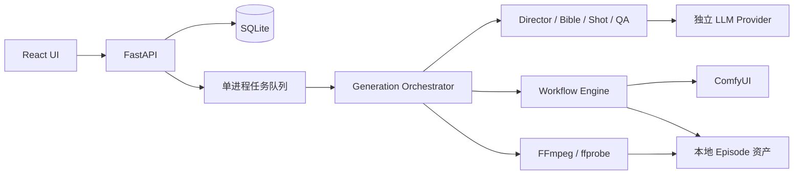

# 模块设计

## C26 参考图警告与当前绑定一致

reconcile_reference_warning 只清理「无 reference_image 输入」这一条条件已失效的警告，不根据工作流名称或声明能力猜测。换绑时更新当前 warnings，先前提示留在换绑历史；生成时重新核对实际绑定。详情 GET 对旧记录只读过滤过期提示，未知/缺失工作流时保留原提示，不访问 ComfyUI；其他警告不受影响。

## C25 工作流尺寸适配

fit_dimensions 只适配绑定到 width/height 且 owner=system 的自动值，复用 check_value 校验工作流类型、范围、枚举与以 min 为起点的 step，同时满足系统 16 对齐与尺寸范围。候选不超过原自动预算或显存上限；没有交集则明确失败。用户顶层尺寸、工作流高级覆盖、AI 值及手动试跑均严格校验，不自动改写；OOM 使用降级后的自动值继续适配。

视频预算在规划前适配并写入 Episode，预览校验/换绑复用相同逻辑。ParameterResolver 在实际图像/视频渲染及重新读取节点元数据后再次校验；没有宽高绑定的图保持自身配置。Job 快照携带明确尺寸标记，已提交的 patched_workflow 保持不变。旧 688 自动预算可收敛为 672，故事、时间线和已有素材不失效，FFmpeg 沿用适配后的输出尺寸。

## C24 可取消的本地等待

取消原先仅设置状态：排队项必须等前面任务结束才释放 busy；当前模型请求也可能继续等待 llm_timeout。两者都会导致已显示取消但无法删除。run_cancellable 以 100ms 间隔检查取消标记，只包裹导演/Bible/Shot/QA 模型调用与生成前的只读 ComfyUI 预检；取消底层等待并等待 finally 清理后再释放 busy。ComfyUI 提交、渲染与下载仍使用原有作业取消协议，不强制中断后擅自判定远端已结束。取消未开始的队列项同步移除并平衡 queue.task_done，不触碰当前其他短片。

## C23 整片重跑入口与旧成片展示

EpisodeRerun 增加「整片重新生成」按钮，打开全部启用镜头的确认表单，默认仅重做视频，保留关键帧及视频选项。沿用 C21 的版本校验、活动/未知作业保护与连续性依赖处理，不引入第二套执行流程。RerunHistory 从全部历史记录筛选有成片的版本，独立显示预览与下载；最近一次失败重跑没有成片时仍显示此前版本。旧镜头继续在折叠历史中查看，页面刷新不影响历史资产。

## C22 帧数绑定与固定生成时钟

秒数是导演时间线单位，工作流可用 length/num_frames 接收 `ceil((seconds×fps-offset)/multiple)×multiple+offset`。Binding 可配置偏移 0～31（兼容旧 0/1）和可选 frame_fps。固定时钟通过 generation_fps 统一预览、规划预算、试跑、Resolver 和 patch；与高级 FPS 覆盖冲突时拒绝，不让保存节点 FPS 与模型时钟不同而导致音画变速。旧绑定不指定 frame_fps 时行为保持。

MiniMax H3 T8 的 24 FPS、17n+5 来自实际节点 `/object_info/MiniMaxH3AudioConditioningT8` 及[节点作者的时间契约](https://github.com/T8mars/comfyui-minimax-h3-audio-T8/blob/main/features.json)。该案例绑定 `6.length`、帧数倍数 17、偏移 5、固定 FPS 24，输出 FPS 绑定 `12.fps`；5 秒生成 124 帧，沿用 FFmpeg 时间线裁剪。没有按节点名称自动推断或重新引入规则识别。

## C21 连接恢复与重跑

GenerationService.rerun 原子校验版本/状态/选择，计算启用时间线上的连续性依赖，归档受影响镜头与旧成片，再失效指定素材并入队；复用导演计划、Bible 和提示词。不清理旧作业或资产文件。seed_offset 与 retry_version 分别控制新候选随机性和作业身份，显式用户覆盖继续由 ParameterResolver 最终决定。只有用户选定的镜头及连续依赖重做已有结果，其他镜头仅按普通续跑补齐缺失结果，完成后拼接当前时间线。

ComfyUIClient 只对已受理作业的读取做有界重连：历史查询共享渲染等待截止时间，下载单个产物使用渲染等待期限；指数退避最多 15 秒，可响应取消。连接恢复沿用原 prompt_id，WebSocket 失败不阻断 HTTP 查询且每 5 秒尝试重连。RenderEngine 合并连接状态与最后采样进度，下载中断清理局部文件，重读产物不再提交工作流。超时和不能确认的取消保持 UNKNOWN。

Episode 页面保留浏览器断线前数据并自动轮询，状态不确定时显示恢复入口及说明；服务重启/等待超时后需显式恢复，不自动创建新渲染。JSON 聚合字段为可选扩展，旧记录无需数据库结构迁移。

## C14 分镜预览与确认

C16：`prompt` 角色只有阶段画面提示词一个生成来源；首帧、尾帧、视频及各参考资产分别取对应描述，再加入 Visual Bible/连续性约束。`usable_ai_values(stage_prompt=True)` 先校验旧 AI 映射，再移除重复 prompt（含非空旁白），其他自定义参数继续进入 ParameterResolver，用户高级覆盖最高。Bible 的原始 AI 映射不嵌入画面文本，避免污染参考图。预览 GET 只读兼容；显式保存时将重复项归档到 Shot.legacy_ai_prompt_parameters，更新持久化视图，失败整笔回滚，计划/时长保持。

新 Agent schema 仍严格限定 AI owner/type/min/max/enum，但不接受由阶段提示词自动绑定的 prompt 角色。上下文标明 workflow 的 media_type、capability 和 source。Shot 增加 narration_text（旧数据可缺省），只存旁白脚本，画面描述不得因无旁白而留空；页面单独展示并注明未合成音频。本轮不接入 TTS，不推断旧文本是否为旁白或改写已完成作业。

C17：预览快照同时保存 `remote_video`，保存/确认时只在工作流版本匹配时复用此执行方式。旧快照缺失时，从已验证 `execution_info.api_nodes` 中核对 duration 绑定节点 ID 与 class_type；实时 `remote_video=false` 优先于缓存，不能仅凭 cloud 标签豁免本地显存限制。实际生成继续读取最新 ComfyUI 元数据，图片显存策略、workflow 上限和单镜时长校验不变。

GenerationService 在现有队列中增加 preview 操作。沿用设备/节点检查、时长预算、Director、Bible 和 Shot Agent，在任何参考图/关键帧渲染前结束。逐镜保存提示词并显示进度，最后进入 AWAITING_REVIEW；重启保留待确认状态，取消或中断可以复用已有结果继续准备。网页不再创建后立即 generate。

`generation/preview.py` 负责实际提示词视图、编辑和时长校验，复用 ParameterResolver 的工作流/显存/高级时长限制。编辑只接受现有镜头 ID 与顺序、标题、时长和三个正向提示词；同步 Shot 与 plan.shots。首帧连续复用、I2V 尾帧、用户指定素材和固定 prompt 标注不可修改原因。其他动态参数和负面/运动约束本轮只读。

保存和确认均在 SQLite 聚合事务中校验 expected_version。确认原子记录批准时间并入队；未经确认的 generate/compose/retry/timeline 入口被拦截。preview 保存工作流版本，配置变动后需更新预览。C18 起未渲染故事通过 `rebind_story` 复用，更新预算、动态参数作用域及派生视图，不重写已有计划/提示词；清除批准、再次等待用户确认。旧绑定的历史作业不阻止新绑定保留故事。旧 Episode 缺省不需要预览，没有表结构迁移。

确认后仍使用原生成、实际尾帧连续性、QA、OOM 和 FFmpeg 流程。已编辑提示词通过 Shot.preview_edited_fields 追踪，渲染时只排除对应 prompt 角色的重复 AI 值，防止覆盖用户预览修改；其他 AI-owned 参数保持，创建时的高级覆盖仍最高。普通重试和 OOM 视频分段同样保留该优先级。

`EpisodePreview.tsx` 展示镜头列表、时长总和及逐镜编辑器，保存/开始按钮常驻；开始自动保存修改再按保存返回的版本确认。轮询不覆盖本页编辑，跨页面修改显示版本冲突并提供重新载入。图片尚未生成时明确显示为文字分镜预览，不使用占位图冒充产物。

## C11 动态模型与渲染时长

Analyzer 按 `COMFY_DYNAMICCOMBO_V3` 当前选项递归读取扁平字段（如 `model.duration`）的类型、min/max/step、枚举与必填项，模型选择器的 enum 使用选项 key。`refresh_profile` 基于模板默认值、已保存参数与用户覆盖读取实际分支，只更新参数快照，保持原始图不变。

`workflows/duration.py` 计算合法的秒数区间：整数、步长与离散枚举向上选择最短可覆盖时间线的值，上限向下对齐至合法值；约束无交集时在规划或参考图生成前失败。`duration_to_frames` 继续使用既有显式转换。ParameterResolver 保存 `timeline_duration` 与实际 `duration`，不改写 Shot 的时间线；用户原始覆盖仍须满足类型、范围、步长与固定时长计划。

C20：视频配置的单镜上限优先，移除自动低显存 3 秒与快速质量 4 秒上限；图片尺寸、batch 等仍使用本地显存预算。`max_duration` 控制时间线，`render_max_duration` 控制渲染，后者仍受 workflow 最大时长和模型范围限制。`duration_limits` 统一给出配置时长，`render_maximum` 再适配模型合法范围。恢复本地/云端任务时均刷新这两个上限，保留已有尺寸、分镜、Bible、参考图与关键帧；待确认预览读取仅派生新范围，显式保存时才持久化，不改写故事。

RenderEngine 在未提交前按最新元数据再次解析/校验并保存实际请求值与预算快照；已提交的 patched JSON 和 UNKNOWN 恢复逻辑保持不变。QA、实际尾帧和 FFmpeg 继续按 Shot 时长取样/裁切，因此 2.86 秒片段可以渲染 4 秒、使用前 2.86 秒。原始生成尾帧不等同于裁切后的实际尾帧。

## C09 / C10 模型测试与超时配置

`agents/diagnostics.py` 复用 LLMProvider 的 JSON/vision 通道，导演模型要求最小 JSON，视觉模型接收临时 32×32 色块图并校验颜色。测试不使用 ComfyUI，不读写 Episode/Job/Asset；测试图在完成、超时或断开时删除。API 监听浏览器断开，并给整个测试设 `llm_timeout` 截止时间。

`Settings` / `SettingsPatch` 统一校验模型超时 1～3600 秒，默认 600；复用在线配置的原子持久化与运行中保护，不新增数据库字段。Provider 以此设置 HTTP 各阶段超时，诊断以此设置含 JSON 纠正的整体截止；前端显示已保存值。ComfyUI 与工作流 AI 识别的独立限时保持原契约。

Provider 每次调用复制配置，避免异步请求期间在线配置变动混用端点和凭据；原有严格 schema 校验与一次纠正保留。连接、读写/连接池超时、通信异常分别返回安全错误分类；HTTP 401/403/404/429/400/422/其他异常分别提示鉴权、权限、模型/端点、限流/额度、协议支持和服务异常。响应不包含上游原文或异常字符串，只保留状态码/异常类型；实际生成同样使用这些分类。

`ModelTests.tsx` 显示导演/视觉测试结果与耗时，可取消等待。编辑配置或密钥、保存、离开页面时取消旧请求并清除结果；取消按钮不被测试本身禁用。缺少视觉模型时提供配置提示，未保存时提示先保存；测试结果仅证明小请求协议与样本识别，不证明长任务稳定性。

## C08 已创建短片的工作流更换

`GenerationService.change_workflows` 在现有 Episode 原子更新中校验 `expected_version`、活动状态和未完成作业，然后经 CapabilityRouter 检查显式工作流身份、本地绑定和保留的高级覆盖。API 无网络等待，不调用 enqueue；表单保存后由用户单独继续生成。

工作流切换先归档旧状态到 `workflow_binding_history`。C18 按当前绑定的作业及素材区分：未渲染且已有计划时，保留 plan/镜头 ID、顺序、时长、Bible 内容、提示词、旁白与用户编辑，只更新适用预算和预览。C19 起已渲染记录使用 resume_story 保留故事、批准和全部素材绑定，旧作业、QA、文件及提交 JSON 不改写。已有结果继续沿用，新绑定仅用于缺失结果或显式重试。历史快照不嵌套已有历史。

未渲染预览的新预算使用已保存的设备可用显存及当前配置计算，保留同版本云端视频执行方式，逐镜验证时长；不兼容时原子拒绝，不偷偷缩短镜头或重写故事。AI 映射按 Bible 的参考 workflow、Shot 的图像/视频 workflow 分别保留，旧模型节点值不迁移到新 ID；新模型未填写的可选自定义 AI 参数使用自身 workflow 默认值。原始映射仍在绑定历史，现存映射保持严格校验。新能力更新尾帧锁定等视图，素材生成时继续由 AssetResolver/Continuity 自动绑定。

只保留仍被选中的 workflow ID 的 override，旧式 image/video 参数仅在对应媒体工作流未更换时保留；重新验证并计算允许的上传资产。`workflow_binding_revision` 为渲染 step_key 加前缀，防止图结构相同的新 profile 命中旧引用缓存；旧记录缺失版本继续原缓存语义。无需升级数据库或重做流水线架构。

`EpisodeWorkflows.tsx` 提供名称概览、分媒体/能力选择和当前默认填充。默认填充点击时读取最新配置；编辑时保存 Episode 版本，不被定时刷新覆盖。运行/未完成作业时入口禁用，服务端仍独立校验；保存成功后，完整未渲染分镜保持待确认，已有进度继续显示图片/视频时间线，尚无故事时继续准备；前端未编辑的预览自动载入新版本，未保存编辑继续保留并提示版本变化。

C19 通过 `refresh_workflow_budget` 在下一次生成时重新读取显存和节点，保留旧预算供成片重新导出；不把旧模型的时长上限套给新模型。`restore_workflow_story` 只恢复空聚合的最近故事快照，要求版本一致、无当前作业或任何未结算作业，逐个校验素材归属与文件；当前工作流不回滚，恢复来源另行记录。文件缺失或检查失败时整笔回滚，无模型/ComfyUI 调用。

## C06 快速导入与 AI 建议

导入仅调用 Analyzer 做 JSON 结构、链接完整性和可写字段提取，并保存用户用途/显式绑定；既有 Input/Output 标签作为显式配置保留。删除 C05 `discovery.py` 规则推断。列表/详情从已存参数返回绑定状态，不重新分析拓扑，也不请求 ComfyUI 或模型服务。

`workflows/recognition.py` 只在用户点击 AI 识别时使用已有 LLMProvider。上下文包含节点、连接、截断的字段示例和可写字段列表，不拉完整 object_info；敏感命名字段脱敏，上下文最多 80000 字符。输出 schema 禁止额外字段，服务端检查真实目标、参数类型、重复占用、能力匹配及显式帧数规则；允许部分建议和不确定说明。总等待上限 45 秒，客户端断开取消模型请求。

识别接口不保存，返回建议与原因。前端先展示建议，确认后仅填入空用途/空输出，保留已有手动选择；导入按钮不等待识别，文件/用途变化与关闭界面会丢弃并取消旧请求。参数与输出页面只展示 JSON 实际可写字段，在每行设置用途、值、owner/覆盖规则；不再创建固定参数行。依赖检查和试跑保持单独入口。无数据库迁移，ParameterResolver、deepcopy patch 和生成恢复契约不变。

## 边界与数据流

## 模块分工（实施契约）

| 目录 | 责任 | 不承担的责任 |
| --- | --- | --- |
| `backend/app/core/` | 环境配置、结构化错误、URL/文件安全 | 从 Agent 内容取得任意网络地址 |
| `backend/app/db/` | SQLite SQLAlchemy 仓储、原子状态更新 | 长事务跨网络等待 |
| `backend/app/workflows/` | API JSON 分析、输入 schema、角色 binding、deepcopy patch、依赖校验 | 写死节点 ID 或原地修改模板 |
| `backend/app/comfyui/` | 上传、prompt、WS/history、结果下载和特定任务取消 | 叙事/QA 决策 |
| `backend/app/agents/` | schema 受限的 Director/Bible/Shot/视觉 QA | 执行 shell、修改设置或直接发渲染请求 |
| `backend/app/generation/` | 队列、可恢复作业、资产流水线、连续性与重试 | 多机分布式调度 |
| `backend/app/media/` | ffprobe、帧提取、规范化和合成 | 替代 AI 渲染 |
| `backend/app/api/` | API/SSE/文件边界与资源操作 | 假装外部依赖可用 |
| `frontend/src/` | 创建、设置、工作流库、Episode/Shot 预览 | 持久保存/读取已存密钥或决定服务端状态 |

## 持久化与任务

实体：WorkflowProfile、Episode（含 plan/bible/continuity）、Shot、Asset、RenderJob、QAResult、设置。资产路径以 Episode ID 分区，文件名由服务端生成。工作流 hash 与使用参数写入 RenderJob。每次执行使用工作流快照，后续编辑不会改变已提交的渲染。

QAResult 为独立追加记录，包含 candidate/keyframes/video 阶段、镜头和资产 ID、六维分数及问题。重试不会覆盖失败证据；镜头聚合保留最近结果供 UI 展示。删除单集同时删除作业和质检元数据，资产清理需显式参数。

生成请求只入队即返回；单 worker 顺序消费，ComfyUI 渲染锁同样约束 Workflow 试跑。每一步完成后持久化。重复生成请求不能创建并行 Episode 运行。取消只删除自身 pending prompt；仅在 ComfyUI 当前运行 prompt 匹配时才 interrupt。提交超时不能盲目重发，因为服务端可能已经受理。

重启将中断的 Episode 标为可诊断失败；已知 prompt_id 可以读取历史恢复结果，未知提交保留 UNKNOWN 状态待核对，禁止自动重复收费渲染。重试复用已成功的计划、参考与镜头资产；视频重试不强制重新生成关键帧。修改/重排上游镜头后失效依赖它的连续镜头及旧成片。

## 质量与媒体

`core/limits.py` 集中定义成片 1～600 秒、六个首页预设、新计划最多 240 镜以及尺寸/FPS/batch 边界；duration.py 仅保留兼容导出。成片时长属于产品策略，单镜头时长属于工作流能力；扩展成片范围不要求提高单镜渲染上限。

Director 按百分之一秒分配总时长，再以最多 12 镜为一批请求模型。每批携带原始 Idea、完整目标时长、起始时间、是否最后一批、统一标题/梗概及最近三镜上下文；合并后重排全局索引，仅整集第一镜强制建立场景。批次间和重试前检查取消；完整计划成功后持久化，规划中断后重新规划。Bible 和后续渲染共用整集设定，逐镜顺序执行。

按 workflow 最大时长和最低 1 秒规划，合计误差不超过 0.5 秒；FPS/长度适配显式写进 binding transform。关键帧后先 QA，再视频；VLM 未配置时明确报告跳过视觉 QA，只执行媒体技术检查。Reference Pack 通过工作流支持的 reference 输入传递，不支持时以 Bible prompt 保持文本一致性并给出能力提示。

CONTINUE_FRAME 使用上一镜实际视频在导出时长内的尾帧；CONTINUE_VIDEO 仅在工作流声明并绑定该能力时启用，否则降级为帧连续。QA 失败按角色/场景、动作、过渡分流。OOM 先降分辨率和 batch，再使用短分段（如配置替代 profile 则同时切换）；保留目标时间线。分段继承实际输出尾帧；替代 profile 使用自身节点参数。OOM 和 QA 共用每镜重试预算，用尽明确失败。

FFmpeg 使用参数数组启动、无 shell，限时运行；先探测文件，统一尺寸/FPS/编码和音轨再拼接，按目标镜头时长裁切；缺少音轨补静音以保留已有原生音频。成片成功需 ffprobe 验证，不能只看文件存在。

镜头边界按累计时间对齐帧网格，避免逐镜取整误差累加；必要时补不足一帧的末帧。临时 MOV 使用 H.264 与 PCM 音轨，拼接清单明确每段时长，最终只编码一次 AAC，避免音频填充累积。临时 PCM 音轨约占 192 KB/秒，合成结束自动清理；最终成片仍为 MP4。

## 在线配置

`core/runtime_settings.py` 管理在线覆盖层，`GET/PATCH /settings` 提供脱敏读取和局部更新。`Settings` 共享对象在持久化成功后一次更新，GenerationService、LLMProvider、ComfyUIClient 及上传限制读取新值；有活动作业时拒绝保存。URL 校验发生异步等待后再次检查活动状态，避免校验期间新任务入队的竞争。

密钥只写入数据目录中权限 0600 的 `runtime-settings.json`，不写入公共 settings 记录，也不在读取/保存响应或错误中回显。原子替换失败时不发布内存配置；空输入保留，显式清除覆盖环境回退。启动加载线上覆盖，并兼容原数据库 ComfyUI 地址。数据目录和允许网页来源继续属于启动配置。

## Workflow 与自动参数解析（C03）

WorkflowProfile 以 media_type + capability 确定文生图、图生图、首尾帧视频或首帧视频；type 只作为旧 API 别名。`workflows/ownership.py` 推导角色 owner 并应用可编辑规则，保留 Analyzer、动态 object_info 约束与原始 Role Binding。Director/Shot/Bible 上下文携带 AI 参数的类型、范围和枚举，输出经本地 schema 与节点约束检查。

`generation/parameters.py` 合并工作流默认、自动值和高级覆盖，并验证能力/资源边界；渲染快照记录输入、显式覆盖和来源，签名包含 capability、规则和覆盖值。`generation/resolvers.py` 的 ContinuityManager 提供角色/风格参考与前镜实际视频，AssetResolver 校验素材类型、归属和文件后上传；缺少实际素材时阻止提交。

C04：`agents/parameters.py` 为 Bible/Shot 构造按 workflow ID 隔离的 AI 参数 schema；允许键来自 owner=ai 的动态元数据，并严格执行本地值校验。Resolver 合并 AI 语义参数，Engine 单独保存原始 AI 映射、纳入签名，并在最终 patch 前再次按 object_info 校验。非语义参数也能自动 patch；用户覆盖最后生效，非法 AI 值不能被覆盖隐藏。流水线按视频 capability 选择单帧或双帧生成/QA，OOM 分段同样按实际使用的 profile 分支。

`workflows/router.py` 封装按能力查询、匹配校验和旧媒体默认兼容。GenerationService 创建/读取 Episode 及低显存替代项统一经过该入口；显式 ID 不被默认路由覆盖。当前不包含新的 UI 选择流程或自动打分选型。

参考资产由默认 TEXT_TO_IMAGE profile 起步，关键帧可选 IMAGE_TO_IMAGE，输入角色参考或刚生成的首帧。视频 capability 决定必须首帧或首尾帧。视频参考需要实际前镜或显式上传；不会为缺失素材伪造路径。原有连续性、Visual Bible、QA、实际尾帧及 FFmpeg 处理保留。

高级时长覆盖在规划前换算并校验，确保每镜时长和整集目标一致。OOM 后以显式恢复标志让较小尺寸、batch、分段时长和实际分段尾帧优先，不能被用户原始覆盖重新放大或替换；替代 profile 继续使用自身节点参数。

`db/migrations.py` 在启动 bootstrap 前运行版本 1 的原子迁移，版本写入 schema_migrations。补全旧工作流/作业快照的身份和元数据、Episode 高级模式及覆盖默认字段；已提交图、prompt_id、资产和超过新上限的旧计划保持不变。失败回滚本次记录更新；重复启动不重复迁移。

## C12 工作流配置界面

`WorkflowsPage` 保留导入与列表，`WorkflowEditor` 管理草稿、保存、依赖检查和试跑；按“输入与输出 / 模型与参数 / 检查与试跑”组织界面。绑定选择器只指向已有可写标量，显示节点标题、字段、ID 和当前值；重复占用的目标禁选，必需项随 capability 变化。可选用途按需添加，不创建不存在的参数。

`WorkflowParameterPanel` 按实际节点分组并提供字段/值搜索；每个字段只有一个模板值编辑器，自动填写 owner 与创作高级覆盖规则独立折叠。恢复导入值读取原 JSON，避免依赖检查后的 effective default 被当作原值。保存和脏状态常驻，取消恢复最近保存版本，切换工作流丢弃草稿需确认。字段错误可跳到对应参数；模型与节点检查、真实试跑均由用户明确触发。

`WorkflowManager.validate` 缓存节点执行信息：存在 `api_node=true` 为 cloud，所有节点类均已获取且未标记 API 为 local，否则 unknown。名称不参与判断；local 仅说明元数据未声明云端 API，不保证第三方节点不联网。导入与列表不增加远程请求。

ComfyUI AUTOGROW 容器的必需输入检查识别其 template.names / prefix 声明的实际点分槽位，例如 `values.a` 可满足 `values` 最小数量；保留普通必填、链接索引及现有参数检查。不从动态槽位推断角色或修改原图。

## C13 导演时长约束

`Directors.plan` 继续读取 workflow/显存/用户上限的有效交集并分批规划，`segment_timing` 为每批产生同一份时间契约。以 `ceil(批次总时长 / 单镜有效上限)` 作为建议镜头数；默认最小时长争取 2.5 秒，当必要镜头数无法满足时下降到可行的百分之一秒值，仍不少于全局 1 秒。允许镜头数同时受该最小时长、批次 12 镜与总镜头 240 上限约束。用户合法的每镜固定时长覆盖默认偏好。

自然语言 system 提示词、context 的 `min_shot_duration/max_shot_duration/min_shots/max_shots/recommended_shots/recommended_shot_duration` 和动态输出 schema 共用时间契约。提示词说明单位是时间线秒数，优先少量完整动作，只有必要的机位/动作变化才增加镜头。模型违反数量或单镜范围时由实际 Provider 的本地 schema 校验拒绝并最多纠正一次，不接受超限碎片。

`normalize_plan` 先求按权重缩放且落在上下限内的精确分配，再以最大余数法分配剩余百分之一秒；使用 Fraction 避免先后顺序扣减和浮点边界偏差。合法原比例保持，均匀权重最多相差 0.01 秒，受约束的片段仍精确覆盖总时间线。时间线秒数与模型实际渲染帧数/最短时长的适配仍由既有 ParameterResolver 完成。

仅没有计划的 Episode 调用新规划。已有计划、镜头、资产、试跑及默认 workflow 均不迁移或静默重拍；旧 1.x 秒镜头仍可恢复、裁切及合成。
