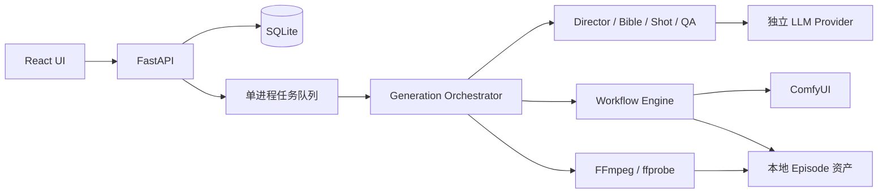

# 模块设计

## C56 完整媒体时间线

媒体 compose 仅接收有序源文件路径，接口不再接收裁切秒数；探测后统一尺寸/FPS/编码，以源音视频完整长度拼接。有限静音补齐无声音轨，明显较长的音轨以末帧停留覆盖；不使用导出时长上限或倍速。归一化后实测长度进入 concat 清单，仅按源音轨声明的完整样本数移除解码器尾部填充，最终 AAC 一次编码，避免音频填充随镜头累计；成片检查针对这些完整片段而非剧本目标。

Engine 只验证有效视频，继续生成不再因比剧本短而使旧媒体及连续后镜失效。QA/优化五点样本、连续性实际尾帧和 OOM 子段尾帧均覆盖完整视频；QA 缓存契约版本更新，旧素材不自动补检或重拍。镜头实际长度随渲染/合成写入，原 Shot.duration 和提示词保持。重新拼接成功后原子归档旧成片并切换当前 ID，错误/取消保留原 ID。

## C55 异步建议式复核

`AdvisoryReviews` 与单个媒体 Worker 并行，一次最多一个视觉模型请求。生成端仍同步验证文件、时长和五点抽帧，再将样本资产 ID 和复核身份保存到 Shot.visual_review 并入队；实际尾帧与连续状态沿用原流程，后镜和 FFmpeg 合成不等待模型。COMPLETED 表示媒体制作完成，复核状态单独显示；模型失败保留成片并提示人工检查，严格质检仍同步拦截。

结果在 Store.atomic 内校验任务 ID、retry_version、视频与前镜尾帧、审核目标、质量/策略和模型配置，原子写入 QA 记录、缓存、当前提示及调用统计。源变化或删除时丢弃过期结果；关闭开关将待检项标为 skipped 并取消当前请求。进程退出保留 pending，启动只恢复已经持久化的待检项，不扫描旧视频补检；失败不会无限自动重试。模型请求整体使用 llm_timeout。

qa_enabled 保持旧默认值，显式关闭不影响技术校验或历史结果。advisory 可运行中切换，strict 仍要求空闲与无未结算提交；用户开关不修改渲染游标。创作包 manual 继续禁止模型复核，只接受原交付的 model 选择。不开启跨镜渲染并发或改动 ComfyUI 工作流。

## C54 本地服务生命周期

`app.service` 是 macOS 运维入口，通过参数数组调用用户级 launchctl，不参与生成编排。安装原子写入私有 plist，固定仓库虚拟环境、数据目录和媒体工具 PATH；不保存模型凭据。RunAtLoad / KeepAlive 与 10 秒启动节流提供独立于终端的进程存活，持久日志启用 Python fault handler。重复 install/start 不中断现有进程；同名外部配置、符号链接与端口占用拒绝处理。显式 stop 先卸载再禁用，避免系统立即重启；start 重新启用。

进程重启继续使用既有 GenerationService.start 与 UNKNOWN 恢复契约，不自动重写剧本、不重新提交未知作业，不修改串行 QA 策略。常驻管理解决缺少自动拉起的问题，不能据此断言先前进程退出的具体原因。

## C53 创作包与 MCP

独立创作包业务服务接收外部持续创作成果。网页 API 与本地 MCP 为同一服务的适配层，后端不持有 Codex 会话。交付产生独立 Episode，复用预览/执行/恢复边界；完整包不得回退内部文字 Agent。见 [C53](CREATION_PACKAGES.md)。

`creation_project` 保存头版本，`creation_revision` 保存不可变包/hash，`creation_request` 保存请求收据。Store 的作用域事务对象让版本、头和收据原子写入，事务内无模型或网络操作。制作确认在 Episode 中原子保存请求身份与 QUEUED，任务由既有 GenerationService 持有。ExternalCreationProvider 阻止意外文字模型调用，只在明确选择视觉复核时按需加载 VLM。MCP 返回结构化失败和限定项目归属的媒体，客户端断线不控制任务生命周期。

## C50 视频工作流原生音频

两套可选 `codex-H3` 视频图复用单次联合采样结果：视频分支保持分块解码，音频分支经现有官方 `VAEDecodeAudio` 与 H3 音频 VAE 解码，连接 `CreateVideo.audio` 后由同一个 `SaveVideo` 输出 MP4。不增加采样、独立音频作业或 TTS；I2V/首尾帧能力、时长时钟、参数 owner 和用户覆盖保持原契约。

AutoDirector 回收整段有声视频，FFmpeg 合成保留源音轨并重采样；C56 起不按参考时间线裁剪；缺少音轨的旧片仍补静音。工作流更新只作用于后续新作业，不改写已保存剧本、素材或历史作业快照。现有两条 codex 配置与对应画布原位更新，不创建新的默认项或启动模板。

## C49 提示词批次准备

仅替换文字预览的缺失提示词循环；导演、审稿、Bible 及依赖真实媒体的生成/重跑沿用原顺序。批次选择连续缺失镜头，遇到已保存项即断开，继续时用保存的末镜状态作为下一段输入，不修改任何旧提示词。

每批 1～3 镜按输入/schema 字符与预估输出预算缩小。多镜 schema 固定每项 shot_id、顺序及各自时长，嵌套现有 AI owner 和动作时间 schema。批内按顺序推导连续状态，批间依旧传递上一镜返回值。单镜回退沿用原 Agent 接口；供应商的一次格式纠正仍是唯一自动纠正预算，网络/限流错误保留结果供显式恢复，不叠加外层重试。

等待前保存运行身份，并在本次调用内固定源输入摘要；模型返回后，本地重新校验输出并在 Store 更新事务内复核运行身份、取消、输入摘要、当前工作流配置及目标提示词仍缺失，才一次性保存整批。取消沿用 run_cancellable 清理所有本地等待；迟到结果不能复活已取消或替换的任务。复用 JSON 聚合，可选 prompt_preparation 保存本轮活动镜号和有限批次记录，无表迁移或旧提示词重写；重启时仅将被中断的准备状态标为失败，保留已完成批次。

页面准备时只读展示剧本/已完成提示词，不复用可编辑预览状态；用户确认入口仍受 AWAITING_REVIEW、完整校验、工作流版本和剧本问题确认保护。调用统计仅保存耗时、计数与 token，不保存模型原始正文或密钥。

## C46 生成前剧本审查

新计划与 `script_review.status=pending` 原子保存。`REVIEWING_SCRIPT` 使用现有导演模型与超时配置，独立请求只包含 Idea、全片计划及当前工作流能力/时长约束，不读取旧 QA。AI 可返回逐镜文字字段修正与尚未解决的问题；不得改镜头编号、数量、顺序、duration、素材、提示词覆盖或运行状态。问题必须有具体证据和可执行建议，合理快切/留白/幻想设定不因审美偏好被判错。

代码在真实 Provider schema 与应用边界校验镜号、字段、冲突和实际变化，再一次性更新 plan/shots，保存原稿及修正原因。成功结果随 Episode 持久化，取消/服务重启/后续失败不重复审查；审查服务失败保留 pending 供重试，绝不冒充通过。既有计划无该标记时保持旧行为。

`needs_attention` 强制进入文字预览，不提交任何渲染；用户确认已检查后才能批准。通过或完成局部修正的剧本按原流程继续。预览列出审查结果与每处变更；审查范围是导演剧本，后续生成的提示词及用户修改不被宣称已经 AI 审核。存储复用 JSON 记录，旧数据不迁移。

## C45 单镜动作时间线

Shot Agent 通过临时 `action_beats[{start,end,action}]` 描述同一镜头的动作阶段。4 秒及以上须 2–4 段，短镜可空或最多 2 段；时间精确到 0.01 秒，严格顺序、连续、完整覆盖镜头。该输出在 Provider schema 内校验，可使用现有一次格式纠正预算，不添加额外模型调用。

通过后编译为 `video_prompt` 末尾的 `Shot timing (seconds):` 及 `0-3s: ...` 行；只持久化这一份可编辑提示词，不持久化第二份节奏配置。首尾帧只描述端点，时间要求传入视频渲染和当前 QA 目标。旧提示词与高级固定覆盖保持原文。

预览修改时长时同步按比例调整受管理时间段；保存时服务端再次校验，手写普通提示词仍受支持。OOM 短分段截取相交阶段并把时间归零，不让每段重复完整动作。AI 复核优化已有时间线时须保留完整时间结构并验证当前时长；不自动改写已有故事或提交重跑。

## C44 观察、优化预览与确认执行

独立 prompt_optimization 模块用当前审核目标、有效复核问题、按时序抽取的五张视频图片、现有输入关键帧及前镜实际尾帧请求视觉模型（最多八图）。旧结论仅作待验证线索，不当作事实；模型需判断 keep/revise/manual，给出原因与仅限当前可编辑字段的三类画面提示词补丁。低置信度不可自动修正。初次 Shot 提示词编写要求动作量匹配固定时长和 capability。

优化方案作为独立 JSON record 保存，不修改 Episode 或创建渲染 Job，临时抽帧清理。确认时复核 Episode 版本、工作流配置版本、可编辑字段和未结算 Job，再由原 rerun 的单次事务归档旧内容、应用补丁、失效所需素材并排队。尾帧修改保留首帧；首帧修改同样保留未修改的尾帧，按模型检查后实际提出的字段补丁重做；固定素材和高级覆盖保持；连续后镜沿原依赖规则刷新。方案绑定源版本，重复确认不能二次提交。已确认方案随重跑历史保留，失败恢复复用已保存新提示词与原 Job 身份。

普通视频 QA 同样增加至五点采样，明确无法证明采样间动作缺失；既有三图调用保持兼容，缓存契约升级。优化影响范围的语义检查只记录提示，避免修正后再次自动重画阻塞；媒体损坏、时长、OOM/UNKNOWN 处理不变。三类提示词外的旁白、AI 动态参数和连续状态不被改写。

## C43 短片详情展示层级

EpisodePage 按成片/镜头预览、重跑、生成设置、诊断记录排列；生成中进度放在镜头列表侧栏，文字预览阶段无播放器时仍展示准备进度。镜头播放器先于说明、首尾帧和完整 QA，辅助内容默认折叠；桌面播放器和受限高度的镜头列表并列，窄屏保持 DOM 中播放器优先。阻断错误保留简短提醒和展开诊断入口，UNKNOWN 恢复操作仍受原保护。展开设置不卸载子组件，保留未保存表单；quality 与 qa-policy 使用不同且随 Episode 固定的 key，避免轮询产生重复节点。生成 API、资产与状态机不变。

## C42 画面复核与执行完成分开

Episode 的 qa_policy 决定语义检查如何影响流水线。旧记录和 API 缺省 strict；新建页显式 advisory。advisory 不进行高质量候选比较和视频前语义检查，每镜先生成可播放视频，再检查一次；保留原评分门槛，将画面不合格、相似端点和视觉模型不可用记为 needs_review/review_notes。PASSED 继续表示媒体执行完成，可供连续性与 FFmpeg 使用，页面单独显示待复核。媒体损坏、时长不足、OOM 重试耗尽、取消与 UNKNOWN 沿用原处理。

review_video 只在模型调用边界把 LLM_* / CONFIGURATION_REQUIRED 转为提示，抽帧和素材读写错误不会被吞掉。qa_video_check 绑定实际视频、前镜实际尾帧、当前审核目标、质量/策略、模型及端点，恢复可复用已经完成的检查；结果变化时重新检查并替换当前视频的旧提示，旧分数与 review_history 保留。主动重跑清理当前缓存及复核标记，旧媒体与快照照常归档。

qa_policy 模块在版本、空闲与未结算作业保护内单独保存策略；仅解开已结算语义 QA 失败，不失效图像、提示词、已完成视频或恢复提交身份，不自动入队。前端保存策略后仅在故事/预览实际未变时推进编辑版本，保留未保存文字。

## C41 质检上下文隔离与失败帧编辑

Directors.qa 用白名单投影当前镜头叙事与审核视觉提示，保留实际图像顺序，排除历史 QA、错误、比较分数、重试状态、旁白和全片 Bible。纠错建议用简洁的目标描述。模型端以 artifact_severity 明确低值为好，兼容输入旧名称 artifact_score；内部/持久化字段不变，评分门槛保持，不根据解释文字反转数值。

IMAGE_TO_IMAGE 且存在 reference_image 绑定时，从 qa_retry.rejected_assets 取得当前被修正帧，配合其 qa_frame_corrections 作为编辑输入。首轮、无反馈或文生图继续原参考策略；用户高级素材覆盖在 ParameterResolver 最后生效。失败图 ID 已持久化，继续与 UNKNOWN 恢复保留输入身份，不删除历史文件。

## C40 当前镜头提示与 QA 重试状态

Shot Agent 仍读取完整 Bible 和连续性上下文，最终渲染使用审核后的阶段提示，避免再次拼入其他镜头人物、生命周期和环境；参考图按其自身描述生成。无 negative 绑定时在参数解析后向自动 prompt 添加限制，显式 prompt 覆盖保持最高优先级，最终长度等约束照常验证。

QAResult 增加可选 failed_frames 与 frame_corrections，关键帧按实际图片顺序检查，I2V 只允许首帧反馈；旧输出保留分数分流。每镜持久化待重试决策、被拒素材 ID 及阶段修正建议，预算耗尽仍展示现有素材，下次继续才解绑失败输出并隔离尝试版本/seed。质检失败后的新尝试与已提交 UNKNOWN 的恢复分开；纠错不修改已审核提示词，用户显式重跑清理旧反馈，切换质量归档旧策略反馈并重检现有画面。旧失败帧的重新检查不占用本次新渲染预算，尝试上限随游标持久化以支持中途 UNKNOWN 恢复。

## C39 生效参数预检与约束可见性

Generation preflight 在给定实时 object_info 下解析自动值/高级覆盖并 deepcopy patch；只校验将执行的参考图、关键帧和视频工作流，跳过尚待 AI/素材绑定的值，按每镜实际时长复核。已有 render_recovery 时不以新前检阻塞旧作业核对；新提交始终经 RenderEngine 再检查。参数冲突以最终生效值为准，非法 AI 输出仍独立拒绝。

RenderEngine 上传前验证图，AssetResolver 先检查所有所需资产的归属/类型/文件，再执行上传；上传后继续最终校验。参数表单和 Agent 上下文/schema 保留源及各消费者的独立 type/min/max/step/enum，特别保留每个步长起点，不错误合并。未知计算节点只能依赖其公开输入约束，本地预检不等同于真实模型执行成功。

## C38 数值透传节点的下游约束

Analyzer 为 PrimitiveInt/PrimitiveFloat.value 的输出 0 收集直连消费者的实际字段 schema，存入参数的 downstream_constraints。check_value 分别验证源参数和每个消费者，保留各自 min/step 起点，避免合并范围后改变合法网格；不穿过数学、开关或未知节点推算输出。依赖检查也验证可确定的直连数值。

实时 refresh_profile 自动补齐旧 profile，已有 fit_dimensions/ParameterResolver/patch 统一使用这些约束。自动 688 高度可向下适配为 672，显式覆盖保留原值并报错；继续生成沿用旧剧本、提示词和首尾帧，已提交 Job 快照不回写。没有新增表或自动渲染操作。

## C37 保留故事切换质量模式

详情页 EpisodeQuality 提供三档质量选择、默认候选数与每镜重试次数说明；保存独立于继续生成/重跑。后端 generation.quality 在版本及空闲状态保护内写入配置，沿用现有预算的尺寸、帧率和时长，仅更新 quality_budget 的候选数与重试次数。质检开启状态和高级 Workflow 参数保持；新规划无已有预算时仍使用正常的质量尺寸策略。

未保存的分镜编辑仅在服务器实际只改变质量、原计划/提示词/预览/工作流等内容均一致时更新基准版本，保留本页文字并允许继续保存；远端故事有更改时仍按原版本冲突处理。页面说明按待审、已取消/失败、已完成状态指向对应的确认、继续或重跑入口。

历史记录归档旧配置与执行上下文，未完成镜头隔离旧 retry_version 并移除旧恢复游标，避免取消在第 4 次高质量尝试后切到标准仍使用旧预算或旧 Job 快照。已有绑定继续使用，缺失部分在用户点击继续生成后补齐；未选中的候选图仍作为历史 Asset/Job 保留，不自动挑选或删除。已完成镜头/成片不自动重做，原重跑入口负责显式重做。

## C35 重跑时重新编写所选镜头提示词

沿用 GenerationService.rerun，增加 prompts 范围。先存历史，再失效素材和提示词，调用原 generate_shot 的缺失提示词分支；生成后持久化并进入 ParameterResolver。重新生成的输出继续受当前 workflow owner/type/min/max/enum 约束，用户高级覆盖不被删除或降级。错误和重连使用原流程，渲染失败续跑复用已保存的新提示词。

依赖展开区分显式选择和间接影响：明确选择的 prompts 镜头不因 CONTINUE_FRAME/CONTINUE_VIDEO 降为仅关键帧；未选择的连续依赖仍复用提示词并重做素材。定格设定通过 pending_static_end_frame 跨提示词重生成保留，显式重跑选项最后应用。旧预览视图、重复 AI 提示词归档标记和旧 continuity_after 不传给本次 Agent；历史快照保留原样，新的连续上下文来自重跑前镜的实际完成状态。

前端第三个生成内容选项明确说明重写提示词与 AI 参数，历史增加提示词/旁白/AI 参数只读展示。分镜故事、时长、Bible 和参考图保持，选择 prompts 不等于重新规划整部故事。

## C33 当前目标优先与首尾帧重复检测

渲染 prompt 先放当前阶段的目标，再放身份特征目录和视觉风格。全片 environment/continuity_rules、历史动作及上一镜原始状态继续提供给 Shot Agent，但不再次拼成渲染硬约束；出场数量、地点、时间以当前目标为准。尾帧参考首帧用于身份保持，明确要求改变为目标终态。高级 prompt/seed 覆盖仍由 ParameterResolver 最后应用。

仅 FIRST_LAST_TO_VIDEO 在提交视频前异步执行本地图像比较，qa_enabled=false 或未配置 VLM 时仍运行。比较 96×96 RGB 平均绝对差和模糊亮度相关系数：MAE≤1/255，或相关系数≥0.995 且 MAE≤0.04，视为近重复。这是保守技术门禁，不能判断细微表演或剧情是否正确；语义检查仍由 VLM 执行。有意定格通过 ShotPrompts.allow_static_end_frame 显式声明，可由预览或重跑覆盖。

近重复记录 keyframe_comparison 与两张资产 ID，按原共享预算只清除当前尾帧绑定并重试；旧文件与 Job 保留。预算耗尽返回 KEYFRAMES_TOO_SIMILAR，用户固定指定尾帧时直接停止，避免无效重试。已存在视频和已受理视频的恢复路径不重复检查；I2V 不生成或检测尾帧。重跑归档旧设定，定格覆盖只影响明确选中镜头，不改连续依赖镜头的意图；提示词尚未准备时暂存 pending_static_end_frame，待 Agent 输出后应用。

数据沿用 JSON 记录，无需表结构迁移：旧提示词缺省按需要变化处理，旧 API 省略定格字段保持原值，读取完成的短片不触发检测或重写。

## C31 内置工作流只在首次初始化添加

已有 settings 记录代表首次初始化已完成，bootstrap 不再把内置工作流缺失视为需要补建。首次创建 settings 前仍按固定 ID 幂等导入两个模板，初始化中断可继续，不覆盖已导入配置。旧 settings 缺少 default_capabilities 时，仅从实际存在的工作流建立能力映射，跳过缺失的旧默认 ID，不恢复已删模板。正常删除仍检查默认和 Episode 引用；不新增表或删除其他数据。

引用导致删除返回 409 时，message 明确说明“未删除”及相关短片名称，details.episodes 返回其 ID/title；默认项拦截同样明确未删除。前端既有错误区域显示该消息，只有收到 204 才提示删除成功。自导入工作流没有启动恢复入口，不能将引用拒绝推断为删除后重建。

## C30 恢复已提交的降级步骤

每镜保存当前尝试的基础参数、重试余量与阶段。继续生成遇到 UNKNOWN 时按 Episode、绑定版本、镜头、retry_version 和尝试号固定原作业链；已失败 OOM 只重放其错误以推进降级，已完成/未结算步骤复用原 Job 快照，禁止重新提交。分段前的中间帧和已完成分段同样复用。恢复记录跨重启保留，到镜头通过后清理；旧记录从已有步骤推导保守恢复上下文。无 prompt_id、其他短片未结算或身份不匹配时保持原保护。

恢复链只取未结算作业创建时及之前的同次尝试，防止旧错误恢复生成的后续失败记录覆盖原 OOM 决策。本次恢复运行沿用相关 Job 的工作流快照，已提交 patched_workflow 保持不变；后续独立运行重新读取当前配置。起始重试余量结合原 OOM 决策重放，不能因重连获得额外降级次数。未结算作业完成后发生本地取帧失败时，持久化恢复映射仍可复用已完成步骤。

## C29 工作流配置版本与检查记录分离

Workflow.configuration_version 记录最后一次可执行配置更改时的记录版本；验证结果、时间戳、试跑指针和名称更新仅增加原 version。预览保存的 workflow_versions 落在 configuration_version～version 区间即仍有效，兼容旧快照及连续多次检测。更改绑定、模型参数、owner、能力等仍使预览失效；实际执行继续获取实时节点约束。

## C28 视频时长技术校验

视频产物按时间线需求校验真实视频流时长（不以较长音轨掩盖短视频），容差为一帧加时间戳舍入误差。新下载及缓存结果均校验，短视频记录在失败作业中并按共享重试预算仅重做视频，不进入视觉 QA 或连续性尾帧。旧版已通过的短视频在用户继续生成时归档后失效，连续依赖镜头同步失效；原文件、剧本和参考资产保留。直接重新导出也校验每镜。

## C27 帧数约束进入规划

帧数输入的范围、枚举和步长与 Binding 的倍数/偏移共同决定合法时长。规划、预览和 ParameterResolver 在创建素材前用相同生成 FPS 计算可用秒数；patch 复用同一帧数转换。允许为较短参考时长生成更长的合法片段，C56 起完整保留，自动计算不超过工作流渲染上限；用户固定覆盖仍严格校验，旧故事不重新规划。

## C26 参考图警告与当前绑定一致

reconcile_reference_warning 只清理「无 reference_image 输入」这一条条件已失效的警告，不根据工作流名称或声明能力猜测。换绑时更新当前 warnings，先前提示留在换绑历史；生成时重新核对实际绑定。详情 GET 对旧记录只读过滤过期提示，未知/缺失工作流时保留原提示，不访问 ComfyUI；其他警告不受影响。

## C25 工作流尺寸适配

fit_dimensions 只适配绑定到 width/height 且 owner=system 的自动值，复用 check_value 校验工作流类型、范围、枚举与以 min 为起点的 step，同时满足系统 16 对齐与尺寸范围。候选不超过原自动预算或显存上限；没有交集则明确失败。用户顶层尺寸、工作流高级覆盖、AI 值及手动试跑均严格校验，不自动改写；OOM 使用降级后的自动值继续适配。

视频预算在规划前适配并写入 Episode，预览校验/换绑复用相同逻辑。ParameterResolver 在实际图像/视频渲染及重新读取节点元数据后再次校验；没有宽高绑定的图保持自身配置。Job 快照携带明确尺寸标记，已提交的 patched_workflow 保持不变。旧 688 自动预算可收敛为 672，故事、时间线和已有素材不失效，FFmpeg 沿用适配后的输出尺寸。

## C24 可取消的本地等待

取消原先仅设置状态：排队项必须等前面任务结束才释放 busy；当前模型请求也可能继续等待 llm_timeout。两者都会导致已显示取消但无法删除。run_cancellable 以 100ms 间隔检查取消标记，只包裹导演/Bible/Shot/QA 模型调用与生成前的只读 ComfyUI 预检；取消底层等待并等待 finally 清理后再释放 busy。ComfyUI 提交、渲染与下载仍使用原有作业取消协议，不强制中断后擅自判定远端已结束。取消未开始的队列项同步移除并平衡 queue.task_done，不触碰当前其他短片。

## C23 整片重跑入口与旧成片展示

EpisodeRerun 增加「整片重新生成」按钮，打开全部启用镜头的确认表单，默认仅重做视频，保留关键帧及视频选项。沿用 C21 的版本校验、活动/未知作业保护与连续性依赖处理，不引入第二套执行流程。RerunHistory 从全部历史记录筛选有成片的版本，独立显示预览与下载；最近一次失败重跑没有成片时仍显示此前版本。旧镜头继续在折叠历史中查看，页面刷新不影响历史资产。

## C22 帧数绑定与固定生成时钟

秒数是导演时间线单位，工作流可用 length/num_frames 接收 `ceil((seconds×fps-offset)/multiple)×multiple+offset`。Binding 可配置偏移 0～31（兼容旧 0/1）和可选 frame_fps。固定时钟通过 generation_fps 统一预览、规划预算、试跑、Resolver 和 patch；与高级 FPS 覆盖冲突时拒绝，不让保存节点 FPS 与模型时钟不同而导致音画变速。旧绑定不指定 frame_fps 时行为保持。

MiniMax H3 T8 的 24 FPS、17n+5 来自实际节点 `/object_info/MiniMaxH3AudioConditioningT8` 及[节点作者的时间契约](https://github.com/T8mars/comfyui-minimax-h3-audio-T8/blob/main/features.json)。该案例绑定 `6.length`、帧数倍数 17、偏移 5、固定 FPS 24，输出 FPS 绑定 `12.fps`；5 秒生成 124 帧，C56 起完整拼接实际生成的 124 帧。没有按节点名称自动推断或重新引入规则识别。

## C21 连接恢复与重跑

GenerationService.rerun 原子校验版本/状态/选择，计算启用时间线上的连续性依赖，归档受影响镜头与旧成片，再失效指定素材并入队；复用导演计划、Bible 和提示词。不清理旧作业或资产文件。seed_offset 与 retry_version 分别控制新候选随机性和作业身份，显式用户覆盖继续由 ParameterResolver 最终决定。只有用户选定的镜头及连续依赖重做已有结果，其他镜头仅按普通续跑补齐缺失结果，完成后拼接当前时间线。

ComfyUIClient 只对已受理作业的读取做有界重连：历史查询共享渲染等待截止时间，下载单个产物使用渲染等待期限；指数退避最多 15 秒，可响应取消。连接恢复沿用原 prompt_id，WebSocket 失败不阻断 HTTP 查询且每 5 秒尝试重连。RenderEngine 合并连接状态与最后采样进度，下载中断清理局部文件，重读产物不再提交工作流。超时和不能确认的取消保持 UNKNOWN。

Episode 页面保留浏览器断线前数据并自动轮询，状态不确定时显示恢复入口及说明；服务重启/等待超时后需显式恢复，不自动创建新渲染。JSON 聚合字段为可选扩展，旧记录无需数据库结构迁移。

## C14 分镜预览与确认

C16：`prompt` 角色只有阶段画面提示词一个生成来源；首帧、尾帧、视频及各参考资产分别取对应描述，再加入 Visual Bible/连续性约束。`usable_ai_values(stage_prompt=True)` 先校验旧 AI 映射，再移除重复 prompt（含非空旁白），其他自定义参数继续进入 ParameterResolver，用户高级覆盖最高。Bible 的原始 AI 映射不嵌入画面文本，避免污染参考图。预览 GET 只读兼容；显式保存时将重复项归档到 Shot.legacy_ai_prompt_parameters，更新持久化视图，失败整笔回滚，计划/时长保持。

新 Agent schema 仍严格限定 AI owner/type/min/max/enum，但不接受由阶段提示词自动绑定的 prompt 角色。上下文标明 workflow 的 media_type、capability 和 source。Shot 增加 narration_text（旧数据可缺省），只存旁白脚本，画面描述不得因无旁白而留空；页面单独展示并注明未合成音频。本轮不接入 TTS，不推断旧文本是否为旁白或改写已完成作业。

C17：预览快照同时保存 `remote_video`，保存/确认时只在工作流版本匹配时复用此执行方式。旧快照缺失时，从已验证 `execution_info.api_nodes` 中核对 duration 绑定节点 ID 与 class_type；实时 `remote_video=false` 优先于缓存，不能仅凭 cloud 标签豁免本地显存限制。实际生成继续读取最新 ComfyUI 元数据，图片显存策略、workflow 上限和单镜时长校验不变。

GenerationService 在现有队列中增加 preview 操作。沿用设备/节点检查、时长预算、Director、Bible 和 Shot Agent，在任何参考图/关键帧渲染前结束。逐镜保存提示词并显示进度，最后进入 AWAITING_REVIEW；重启保留待确认状态，取消或中断可以复用已有结果继续准备。网页不再创建后立即 generate。

`generation/preview.py` 负责实际提示词视图、编辑和时长校验，复用 ParameterResolver 的工作流/显存/高级时长限制。编辑只接受现有镜头 ID 与顺序、标题、时长和三个正向提示词；同步 Shot 与 plan.shots。首帧连续复用、I2V 尾帧、用户指定素材和固定 prompt 标注不可修改原因。其他动态参数和负面/运动约束本轮只读。

保存和确认均在 SQLite 聚合事务中校验 expected_version。确认原子记录批准时间并入队；未经确认的 generate/compose/retry/timeline 入口被拦截。preview 保存工作流版本，配置变动后需更新预览。C18 起未渲染故事通过 `rebind_story` 复用，更新预算、动态参数作用域及派生视图，不重写已有计划/提示词；清除批准、再次等待用户确认。旧绑定的历史作业不阻止新绑定保留故事。旧 Episode 缺省不需要预览，没有表结构迁移。

确认后仍使用原生成、实际尾帧连续性、QA、OOM 和 FFmpeg 流程。已编辑提示词通过 Shot.preview_edited_fields 追踪，渲染时只排除对应 prompt 角色的重复 AI 值，防止覆盖用户预览修改；其他 AI-owned 参数保持，创建时的高级覆盖仍最高。普通重试和 OOM 视频分段同样保留该优先级。

`EpisodePreview.tsx` 展示镜头列表、时长总和及逐镜编辑器，保存/开始按钮常驻；开始自动保存修改再按保存返回的版本确认。轮询不覆盖本页编辑，跨页面修改显示版本冲突并提供重新载入。图片尚未生成时明确显示为文字分镜预览，不使用占位图冒充产物。

## C11 动态模型与渲染时长

Analyzer 按 `COMFY_DYNAMICCOMBO_V3` 当前选项递归读取扁平字段（如 `model.duration`）的类型、min/max/step、枚举与必填项，模型选择器的 enum 使用选项 key。`refresh_profile` 基于模板默认值、已保存参数与用户覆盖读取实际分支，只更新参数快照，保持原始图不变。

`workflows/duration.py` 计算合法的秒数区间：整数、步长与离散枚举向上选择最短可覆盖时间线的值，上限向下对齐至合法值；约束无交集时在规划或参考图生成前失败。`duration_to_frames` 继续使用既有显式转换。ParameterResolver 保存 `timeline_duration` 与实际 `duration`，不改写 Shot 的时间线；用户原始覆盖仍须满足类型、范围、步长与固定时长计划。

C20：视频配置的单镜上限优先，移除自动低显存 3 秒与快速质量 4 秒上限；图片尺寸、batch 等仍使用本地显存预算。`max_duration` 控制时间线，`render_max_duration` 控制渲染，后者仍受 workflow 最大时长和模型范围限制。`duration_limits` 统一给出配置时长，`render_maximum` 再适配模型合法范围。恢复本地/云端任务时均刷新这两个上限，保留已有尺寸、分镜、Bible、参考图与关键帧；待确认预览读取仅派生新范围，显式保存时才持久化，不改写故事。

RenderEngine 在未提交前按最新元数据再次解析/校验并保存实际请求值与预算快照；已提交的 patched JSON 和 UNKNOWN 恢复逻辑保持不变。C56 起 QA、实际尾帧和 FFmpeg 都覆盖完整源片段，因此参考 2.86 秒但实际生成 4 秒时，完整使用 4 秒；实际尾帧取完整视频末尾。

## C09 / C10 模型测试与超时配置

`agents/diagnostics.py` 复用 LLMProvider 的 JSON/vision 通道，导演模型要求最小 JSON，视觉模型接收临时 32×32 色块图并校验颜色。测试不使用 ComfyUI，不读写 Episode/Job/Asset；测试图在完成、超时或断开时删除。API 监听浏览器断开，并给整个测试设 `llm_timeout` 截止时间。

`Settings` / `SettingsPatch` 统一校验模型超时 1～3600 秒，默认 600；复用在线配置的原子持久化与运行中保护，不新增数据库字段。Provider 以此设置 HTTP 各阶段超时，诊断以此设置含 JSON 纠正的整体截止；前端显示已保存值。ComfyUI 与工作流 AI 识别的独立限时保持原契约。

Provider 每次调用复制配置，避免异步请求期间在线配置变动混用端点和凭据；原有严格 schema 校验与一次纠正保留。连接、读写/连接池超时、通信异常分别返回安全错误分类；HTTP 401/403/404/429/400/422/其他异常分别提示鉴权、权限、模型/端点、限流/额度、协议支持和服务异常。响应不包含上游原文或异常字符串，只保留状态码/异常类型；实际生成同样使用这些分类。

`ModelTests.tsx` 显示导演/视觉测试结果与耗时，可取消等待。编辑配置或密钥、保存、离开页面时取消旧请求并清除结果；取消按钮不被测试本身禁用。缺少视觉模型时提供配置提示，未保存时提示先保存；测试结果仅证明小请求协议与样本识别，不证明长任务稳定性。

## C08 已创建短片的工作流更换

`GenerationService.change_workflows` 在现有 Episode 原子更新中校验 `expected_version`、活动状态和未完成作业，然后经 CapabilityRouter 检查显式工作流身份、本地绑定和保留的高级覆盖。API 无网络等待，不调用 enqueue；表单保存后由用户单独继续生成。

工作流切换先归档旧状态到 `workflow_binding_history`。C18 按当前绑定的作业及素材区分：未渲染且已有计划时，保留 plan/镜头 ID、顺序、时长、Bible 内容、提示词、旁白与用户编辑，只更新适用预算和预览。C19 起已渲染记录使用 resume_story 保留故事、批准和全部素材绑定，旧作业、QA、文件及提交 JSON 不改写。已有结果继续沿用，新绑定仅用于缺失结果或显式重试。历史快照不嵌套已有历史。

未渲染预览的新预算使用已保存的设备可用显存及当前配置计算，保留同版本云端视频执行方式，逐镜验证时长；不兼容时原子拒绝，不偷偷缩短镜头或重写故事。AI 映射按 Bible 的参考 workflow、Shot 的图像/视频 workflow 分别保留，旧模型节点值不迁移到新 ID；新模型未填写的可选自定义 AI 参数使用自身 workflow 默认值。原始映射仍在绑定历史，现存映射保持严格校验。新能力更新尾帧锁定等视图，素材生成时继续由 AssetResolver/Continuity 自动绑定。

只保留仍被选中的 workflow ID 的 override，旧式 image/video 参数仅在对应媒体工作流未更换时保留；重新验证并计算允许的上传资产。`workflow_binding_revision` 为渲染 step_key 加前缀，防止图结构相同的新 profile 命中旧引用缓存；旧记录缺失版本继续原缓存语义。无需升级数据库或重做流水线架构。

`EpisodeWorkflows.tsx` 提供名称概览、分媒体/能力选择和当前默认填充。默认填充点击时读取最新配置；编辑时保存 Episode 版本，不被定时刷新覆盖。运行/未完成作业时入口禁用，服务端仍独立校验；保存成功后，完整未渲染分镜保持待确认，已有进度继续显示图片/视频时间线，尚无故事时继续准备；前端未编辑的预览自动载入新版本，未保存编辑继续保留并提示版本变化。

C19 通过 `refresh_workflow_budget` 在下一次生成时重新读取显存和节点，保留旧预算供成片重新导出；不把旧模型的时长上限套给新模型。`restore_workflow_story` 只恢复空聚合的最近故事快照，要求版本一致、无当前作业或任何未结算作业，逐个校验素材归属与文件；当前工作流不回滚，恢复来源另行记录。文件缺失或检查失败时整笔回滚，无模型/ComfyUI 调用。

## C06 快速导入与 AI 建议

导入仅调用 Analyzer 做 JSON 结构、链接完整性和可写字段提取，并保存用户用途/显式绑定；既有 Input/Output 标签作为显式配置保留。删除 C05 `discovery.py` 规则推断。列表/详情从已存参数返回绑定状态，不重新分析拓扑，也不请求 ComfyUI 或模型服务。

`workflows/recognition.py` 只在用户点击 AI 识别时使用已有 LLMProvider。上下文包含节点、连接、截断的字段示例和可写字段列表，不拉完整 object_info；敏感命名字段脱敏，上下文最多 80000 字符。输出 schema 禁止额外字段，服务端检查真实目标、参数类型、重复占用、能力匹配及显式帧数规则；允许部分建议和不确定说明。总等待上限读取当前在线 llm_timeout，与模型测试共用配置；客户端断开取消模型请求。

识别接口不保存，返回建议与原因。前端先展示建议，确认后仅填入空用途/空输出，保留已有手动选择；导入按钮不等待识别，文件/用途变化与关闭界面会丢弃并取消旧请求。参数与输出页面只展示 JSON 实际可写字段，在每行设置用途、值、owner/覆盖规则；不再创建固定参数行。依赖检查和试跑保持单独入口。无数据库迁移，ParameterResolver、deepcopy patch 和生成恢复契约不变。

## 边界与数据流

## 模块分工（实施契约）

| 目录 | 责任 | 不承担的责任 |
| --- | --- | --- |
| `backend/app/core/` | 环境配置、结构化错误、URL/文件安全 | 从 Agent 内容取得任意网络地址 |
| `backend/app/db/` | SQLite SQLAlchemy 仓储、原子状态更新 | 长事务跨网络等待 |
| `backend/app/workflows/` | API JSON 分析、输入 schema、角色 binding、deepcopy patch、依赖校验 | 写死节点 ID 或原地修改模板 |
| `backend/app/comfyui/` | 上传、prompt、WS/history、结果下载和特定任务取消 | 叙事/QA 决策 |
| `backend/app/agents/` | schema 受限的 Director/Bible/Shot/视觉 QA | 执行 shell、修改设置或直接发渲染请求 |
| `backend/app/generation/` | 队列、可恢复作业、资产流水线、连续性与重试 | 多机分布式调度 |
| `backend/app/media/` | ffprobe、帧提取、规范化和合成 | 替代 AI 渲染 |
| `backend/app/api/` | API/SSE/文件边界与资源操作 | 假装外部依赖可用 |
| `frontend/src/` | 创建、设置、工作流库、Episode/Shot 预览 | 持久保存/读取已存密钥或决定服务端状态 |

## 持久化与任务

实体：WorkflowProfile、Episode（含 plan/bible/continuity）、Shot、Asset、RenderJob、QAResult、设置。资产路径以 Episode ID 分区，文件名由服务端生成。工作流 hash 与使用参数写入 RenderJob。每次执行使用工作流快照，后续编辑不会改变已提交的渲染。

QAResult 为独立追加记录，包含 candidate/keyframes/video 阶段、镜头和资产 ID、六维分数及问题。重试不会覆盖失败证据；镜头聚合保留最近结果供 UI 展示。删除单集同时删除作业和质检元数据，资产清理需显式参数。

生成请求只入队即返回；单 worker 顺序消费，ComfyUI 渲染锁同样约束 Workflow 试跑。每一步完成后持久化。重复生成请求不能创建并行 Episode 运行。取消只删除自身 pending prompt；仅在 ComfyUI 当前运行 prompt 匹配时才 interrupt。提交超时不能盲目重发，因为服务端可能已经受理。

重启将中断的 Episode 标为可诊断失败；已知 prompt_id 可以读取历史恢复结果，未知提交保留 UNKNOWN 状态待核对，禁止自动重复收费渲染。重试复用已成功的计划、参考与镜头资产；视频重试不强制重新生成关键帧。修改/重排上游镜头后失效依赖它的连续镜头及旧成片。

## 质量与媒体

`core/limits.py` 集中定义成片 1～600 秒、六个首页预设、新计划最多 240 镜以及尺寸/FPS/batch 边界；duration.py 仅保留兼容导出。成片时长属于产品策略，单镜头时长属于工作流能力；扩展成片范围不要求提高单镜渲染上限。

Director 按百分之一秒分配总时长，再以最多 12 镜为一批请求模型。每批携带原始 Idea、完整目标时长、起始时间、是否最后一批、统一标题/梗概及最近三镜上下文；合并后重排全局索引，仅整集第一镜强制建立场景。批次间和重试前检查取消；完整计划成功后持久化，规划中断后重新规划。Bible 和后续渲染共用整集设定，逐镜顺序执行。

按 workflow 最大时长和最低 1 秒规划，合计误差不超过 0.5 秒；FPS/长度适配显式写进 binding transform。关键帧后先 QA，再视频；VLM 未配置时明确报告跳过视觉 QA，只执行媒体技术检查。Reference Pack 通过工作流支持的 reference 输入传递，不支持时以 Bible prompt 保持文本一致性并给出能力提示。

CONTINUE_FRAME 使用上一镜完整实际视频的尾帧；CONTINUE_VIDEO 仅在工作流声明并绑定该能力时启用，否则降级为帧连续。QA 失败按角色/场景、动作、过渡分流。OOM 先降分辨率和 batch，再使用短分段（如配置替代 profile 则同时切换）；保留目标时间线。分段继承实际输出尾帧；替代 profile 使用自身节点参数。OOM 和 QA 共用每镜重试预算，用尽明确失败。

FFmpeg 使用参数数组启动、无 shell，限时运行；先探测文件，统一尺寸/FPS/编码和音轨再拼接，C56 起完整保留片段，目标镜头时长只作参考；缺少音轨补静音以保留已有原生音频。成片成功需 ffprobe 验证，不能只看文件存在。

C56 起镜头边界采用完整源片段归一化后的实测时长，不再按参考时间线取整截尾。临时 MOV 使用 H.264 与 PCM 音轨，拼接清单明确每段时长，最终只编码一次 AAC，避免音频填充累积。临时 PCM 音轨约占 192 KB/秒，合成结束自动清理；最终成片仍为 MP4。

## 在线配置

`core/runtime_settings.py` 管理在线覆盖层，`GET/PATCH /settings` 提供脱敏读取和局部更新。`Settings` 共享对象在持久化成功后一次更新，GenerationService、LLMProvider、ComfyUIClient 及上传限制读取新值；有活动作业时拒绝保存。URL 校验发生异步等待后再次检查活动状态，避免校验期间新任务入队的竞争。

密钥只写入数据目录中权限 0600 的 `runtime-settings.json`，不写入公共 settings 记录，也不在读取/保存响应或错误中回显。原子替换失败时不发布内存配置；空输入保留，显式清除覆盖环境回退。启动加载线上覆盖，并兼容原数据库 ComfyUI 地址。数据目录和允许网页来源继续属于启动配置。

## Workflow 与自动参数解析（C03）

WorkflowProfile 以 media_type + capability 确定文生图、图生图、首尾帧视频或首帧视频；type 只作为旧 API 别名。`workflows/ownership.py` 推导角色 owner 并应用可编辑规则，保留 Analyzer、动态 object_info 约束与原始 Role Binding。Director/Shot/Bible 上下文携带 AI 参数的类型、范围和枚举，输出经本地 schema 与节点约束检查。

`generation/parameters.py` 合并工作流默认、自动值和高级覆盖，并验证能力/资源边界；渲染快照记录输入、显式覆盖和来源，签名包含 capability、规则和覆盖值。`generation/resolvers.py` 的 ContinuityManager 提供角色/风格参考与前镜实际视频，AssetResolver 校验素材类型、归属和文件后上传；缺少实际素材时阻止提交。

C04：`agents/parameters.py` 为 Bible/Shot 构造按 workflow ID 隔离的 AI 参数 schema；允许键来自 owner=ai 的动态元数据，并严格执行本地值校验。Resolver 合并 AI 语义参数，Engine 单独保存原始 AI 映射、纳入签名，并在最终 patch 前再次按 object_info 校验。非语义参数也能自动 patch；用户覆盖最后生效，非法 AI 值不能被覆盖隐藏。流水线按视频 capability 选择单帧或双帧生成/QA，OOM 分段同样按实际使用的 profile 分支。

`workflows/router.py` 封装按能力查询、匹配校验和旧媒体默认兼容。GenerationService 创建/读取 Episode 及低显存替代项统一经过该入口；显式 ID 不被默认路由覆盖。当前不包含新的 UI 选择流程或自动打分选型。

参考资产由默认 TEXT_TO_IMAGE profile 起步，关键帧可选 IMAGE_TO_IMAGE，输入角色参考或刚生成的首帧。视频 capability 决定必须首帧或首尾帧。视频参考需要实际前镜或显式上传；不会为缺失素材伪造路径。原有连续性、Visual Bible、QA、实际尾帧及 FFmpeg 处理保留。

高级时长覆盖在规划前换算并校验，确保每镜时长和整集目标一致。OOM 后以显式恢复标志让较小尺寸、batch、分段时长和实际分段尾帧优先，不能被用户原始覆盖重新放大或替换；替代 profile 继续使用自身节点参数。

`db/migrations.py` 在启动 bootstrap 前运行版本 1 的原子迁移，版本写入 schema_migrations。补全旧工作流/作业快照的身份和元数据、Episode 高级模式及覆盖默认字段；已提交图、prompt_id、资产和超过新上限的旧计划保持不变。失败回滚本次记录更新；重复启动不重复迁移。

## C12 工作流配置界面

`WorkflowsPage` 保留导入与列表，`WorkflowEditor` 管理草稿、保存、依赖检查和试跑；按“输入与输出 / 模型与参数 / 检查与试跑”组织界面。绑定选择器只指向已有可写标量，显示节点标题、字段、ID 和当前值；重复占用的目标禁选，必需项随 capability 变化。可选用途按需添加，不创建不存在的参数。

`WorkflowParameterPanel` 按实际节点分组并提供字段/值搜索；每个字段只有一个模板值编辑器，自动填写 owner 与创作高级覆盖规则独立折叠。恢复导入值读取原 JSON，避免依赖检查后的 effective default 被当作原值。保存和脏状态常驻，取消恢复最近保存版本，切换工作流丢弃草稿需确认。字段错误可跳到对应参数；模型与节点检查、真实试跑均由用户明确触发。

`WorkflowManager.validate` 缓存节点执行信息：存在 `api_node=true` 为 cloud，所有节点类均已获取且未标记 API 为 local，否则 unknown。名称不参与判断；local 仅说明元数据未声明云端 API，不保证第三方节点不联网。导入与列表不增加远程请求。

ComfyUI AUTOGROW 容器的必需输入检查识别其 template.names / prefix 声明的实际点分槽位，例如 `values.a` 可满足 `values` 最小数量；保留普通必填、链接索引及现有参数检查。不从动态槽位推断角色或修改原图。

## C13 / C36 导演时长约束与剧情节奏

`Directors.plan` 读取有效工作流/用户上限并分批规划。`ceil(批次总时长 / 单镜有效上限)` 只作镜头数下限，Director 根据剧情动作、情绪和机位选择实际数量及每镜秒数。`segment_timing` 默认硬下限为 1 秒；2.5 秒仅是持续动作的软提示，不限制合理的短暂反应/细节镜头。用户合法固定时长仍令上下限相等。等长或非等长均可采用，不人为随机化时长。

有数量选择空间时，自动批次按最多 6 个最低必需镜头对应的时间容量划分，每批可输出最多 12 镜，避免旧 12×上限的整批把镜头数和时长一起排死。固定时长或容量约束已唯一决定数量时仍按 12 镜分批，避免无意义增加模型调用。每批先预留后续批次的最低必要数量，再用剩余全片额度收紧 `max_shots`，保障最终最多 240 镜。前序三镜、全片剧情、片名和结尾标志继续进入后续批次。

自然语言 system、context 的 `min_shot_duration/max_shot_duration/min_shots/max_shots` 和动态 schema 共用硬约束，context 的 `preferred_min_shot_duration` 仅作软提示，不提供推荐数量/等长值。模型违反数量或单镜范围时由实际 Provider 校验拒绝并最多纠正一次；仅避免机械碎切，不把合法短镜视为错误。

`normalize_plan` 先求按权重缩放且落在上下限内的精确分配，再以最大余数法分配剩余百分之一秒；使用 Fraction 避免先后顺序扣减和浮点边界偏差。合法原比例保持，均匀权重最多相差 0.01 秒，受约束的片段仍精确覆盖总时间线。时间线秒数与模型实际渲染帧数/最短时长的适配仍由既有 ParameterResolver 完成。

仅没有计划的 Episode 调用新规划。已有计划、镜头、资产、试跑及默认 workflow 均不迁移或静默重拍；旧 1.x 秒镜头仍可恢复并完整合成。

## C52 原生声画提示词

`Capabilities.audio_prompt_format` 为显式可选契约：`none`（兼容旧配置）或 `minimax_h3`，后者仅用于视频。`ai_parameters()` 把声明传给视频 prompt role；单镜/批次共用 `audio_output` 和动作时间约束。三个 H3 区块与其中 `Speech performance` 段校验后进入唯一可编辑的 `video_prompt`，旁白副本必须原文入标签，图片不允许台词标签。无新持久字段、无故事迁移。

ParameterResolver 在时长帧数适配后补 Picture 时间引用，重复解析幂等，用户高级 prompt override 保持原值。视觉优化原样保留声音段；有声对白 OOM 降分辨率后只允许整镜原生声音 fallback，避免盲目短分段重复台词。旧提示词和旧素材保持，只有新的提示词生成采用此契约。
